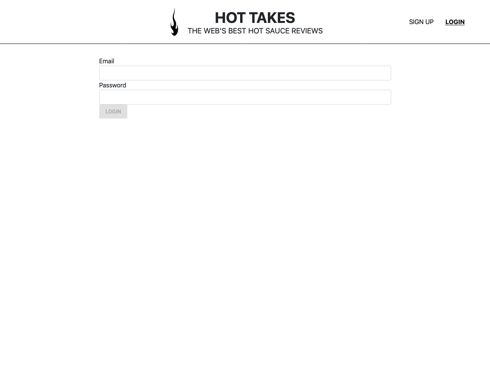
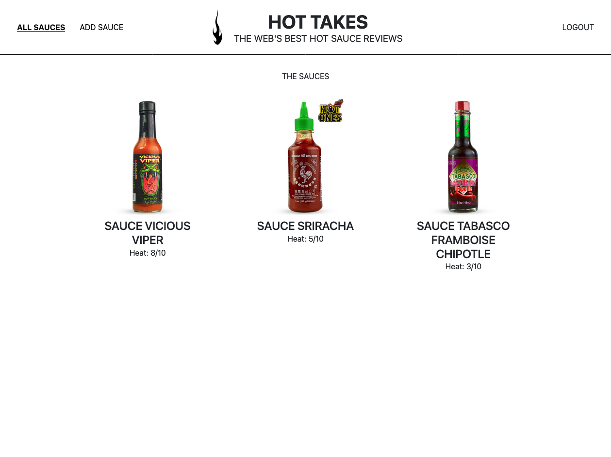
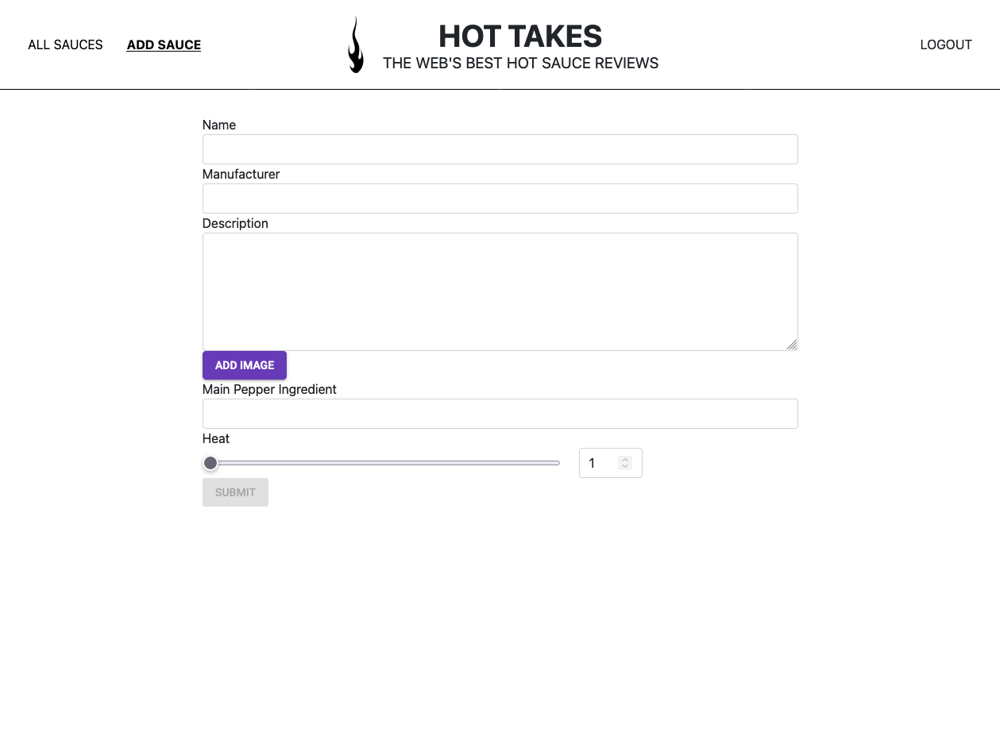

# Hot Takes

Projet n°6 du [parcours Développeur Web](https://openclassrooms.com/fr/paths/556-developpeur-web#path-tabs) d'OpenClassrooms : _Construisez une API sécurisée pour une application d'avis gastronomiques_.

> Il s'agit d'implémenter l'API du site Piiquante avec une base de donnée NoSQL. Les données utilisateurs doivent respectées le RGPD et l'API doit être sécurisée en respectant les préconisation de l'OWASP.

## 🔧 Prérequis

Afin de pouvoir exécuter l'application sur votre poste, vous devez d'aborder installer les dépendances suivantes :

- NodeJS
- `npm`

Pour les installer, sélectionner la version correspondant à votre système d'exploitation sur [cette page](https://nodejs.org/fr/download/) puis suivez les étapes d'installation.

## 📚 Technologie utilisées

- JavaScript
- NodeJS
- Express
- MongoDB

## 📦 Installation des packages

Dans le dossier **backend**, avec le terminal, exécutez la commande `npm install` pour installer les packages requis pour le fonctionnement de l'API.
Dans le dossier **frontend**, avec le terminal, exécutez la commande `npm install` pour installer les packages requis pour le fonctionnement du front.

## 🔐 Variables d'environnement

Dans le dossier **backend**, créez le fichier **.env**.
Dans ce fichier, déclarez 3 variables :

```
JWT_SECRET_TOKEN=
DB_USERNAME=mentor
DB_PASSWORD=soutenance
```

`JWT_SECRET_TOKEN` est une clé de sécurité composée de 16 caractères alphanumériques que vous devez choisir.

## ⚙️ Exécution

Pour démarrer le serveur, dans le dossier **backend**, avec le terminal, exécutez la commande `node server`.
Si tout se passe bien, le message suivant devrait s'afficher dans le terminal :

```
Listening on port 3000.
```

Si le serveur s'exécute sur un autre port, celui-ci sera affiché dans la console à la place de `port 3000`.
Le statut de la connexion avec la base de donnée s'affiche sur la console quand le serveur démarre : `Connection to MongoDB succeeded` ou `Connection to MongoDB failed`.

Pour démarrer le serveur d'affichage du frontend, dans le dossier **frontend**, avec le terminal, exécutez la commande `npm start`.

## 📎 Rendu visuel





